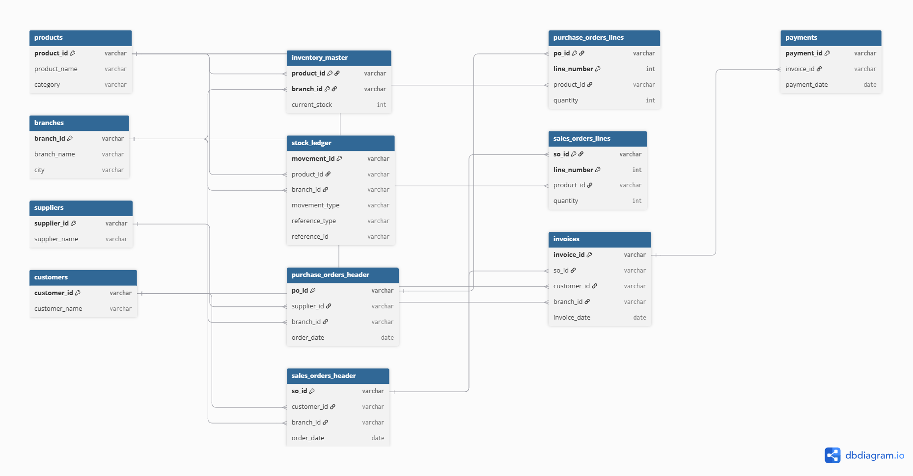

# Week 1 — Full Findings Record

**Heavy Supplier, Inventory & Warehouse Analytics**
CadetX Virtual Work Experience — Personal record covering all 4 Week 1 requirements

**Contents:** 1) Dataset Structure & Overview · 2) Primary & Foreign Key Mapping · 3) Table Relationship Mapping (ERD) · 4) Inventory Anomaly Investigation (`current_stock` vs `max_stock`)

---

## 1. Dataset Structure & Overview

The dataset contains 12 tables, covering the full operational flow from suppliers through warehouse stock to customer sales and payments.

| Table | Rows | What it contains |
|---|---|---|
| branches | 6 | Warehouse/branch details (location, capacity, staff, revenue) |
| customers | 500 | Customer master data |
| products | 30 | Product master data (category, cost, price, reorder settings) |
| suppliers | 8 | Supplier master data (type, lead time, reliability score) |
| inventory_master | 180 | Stock levels per product per branch |
| stock_ledger | 237,230 | Full history of every stock movement (in/out/adjustment) |
| purchase_orders_header | 24,000 | Purchase order summaries |
| purchase_orders_lines | 155,495 | Line-item detail for each purchase order |
| sales_orders_header | 20,000 | Sales order summaries |
| sales_orders_lines | 130,402 | Line-item detail for each sales order |
| invoices | 18,033 | Billing records tied to sales orders |
| payments | 19,257 | Payments received against invoices |

This is a realistic, transactional dataset spanning roughly 6 years (2019–2025) of activity across 6 branches.

## 2. Primary & Foreign Key Mapping

| Table | Primary Key | Foreign Key(s) |
|---|---|---|
| branches | branch_id | — |
| customers | customer_id | — |
| products | product_id | — |
| suppliers | supplier_id | — |
| inventory_master | product_id + branch_id (composite) | product_id → products; branch_id → branches |
| purchase_orders_header | po_id | supplier_id → suppliers; branch_id → branches |
| purchase_orders_lines | po_id + line_number (composite) | po_id → purchase_orders_header; product_id → products |
| sales_orders_header | so_id | customer_id → customers; branch_id → branches |
| sales_orders_lines | so_id + line_number (composite) | so_id → sales_orders_header; product_id → products |
| invoices | invoice_id | so_id → sales_orders_header; customer_id → customers; branch_id → branches |
| payments | payment_id | invoice_id → invoices |
| stock_ledger | movement_id | product_id → products; branch_id → branches; reference_type + reference_id → either purchase_orders_header (PO) or sales_orders_header (SO) |

**Referential integrity verified:** all key relationships were tested directly against the data — checked `product_id`, `branch_id`, `supplier_id`, and `customer_id` references across multiple tables. Zero orphan/broken references found anywhere. `inventory_master` also has exactly the expected 180 rows (30 products × 6 branches), confirming complete, correct coverage with no duplication.

## 3. Table Relationship Mapping (Entity Relationship Diagram)

Building on the key mapping above, this ERD shows how all 12 tables connect to one another.

**Live, interactive version** (zoomable, click `stock_ledger` to see the reference note): https://dbdiagram.io/d/6aa7107436f9982564809e24

**How to read this diagram**
- Each box represents one table, listing its columns.
- A key icon next to a column marks it as part of that table's primary key.
- Lines connect a foreign key in one table to the primary key it references in another.

**Standalone master tables**
`products`, `branches`, `suppliers`, and `customers` each describe a single type of entity on their own, with no foreign keys referencing other tables.

**Composite-key tables**
`inventory_master`, `purchase_orders_lines`, and `sales_orders_lines` each exist specifically to connect two other things together, requiring two columns combined to uniquely identify each row:
- `inventory_master`: product_id + branch_id (this product, at this branch)
- `purchase_orders_lines`: po_id + line_number (this line item, within this purchase order)
- `sales_orders_lines`: so_id + line_number (this line item, within this sales order)

**A note on `stock_ledger`'s flexible reference**
`stock_ledger.reference_id` is not drawn as a single fixed link, because it can point to either `purchase_orders_header` (when `reference_type = 'PO'`) or `sales_orders_header` (when `reference_type = 'SO'`), depending on the row.

## 4. Inventory Anomaly Investigation — `current_stock` vs `max_stock`

**Finding**
All 180 rows in `inventory_master` show `current_stock` far exceeding `max_stock` — ranging from 177x to 854x over capacity, averaging 385x.

**Investigation and root cause**
- Confirmed `current_stock` is not an independent figure — it exactly matches the last `running_balance` value in `stock_ledger` for that product/branch (verified across all 180 rows, 100% match)
- Traced the imbalance to movement sizes: IN movements average ~160 units each (tied to purchase orders), while OUT movements average only ~10 units each (tied to sales orders) — roughly a 16x difference
- Movement counts are fairly close (127,611 IN vs 107,165 OUT), so the issue isn't frequency — it's that each delivery brings in far more than each sale removes
- Compounded over ~6 years of continuous history with no resets, the cumulative balance has grown to far exceed any realistic warehouse capacity

**Why it matters**
Any KPI relying on `current_stock` as a live snapshot (stockout risk, overstock detection, reorder-point triggers) will be meaningless if used as-is.
